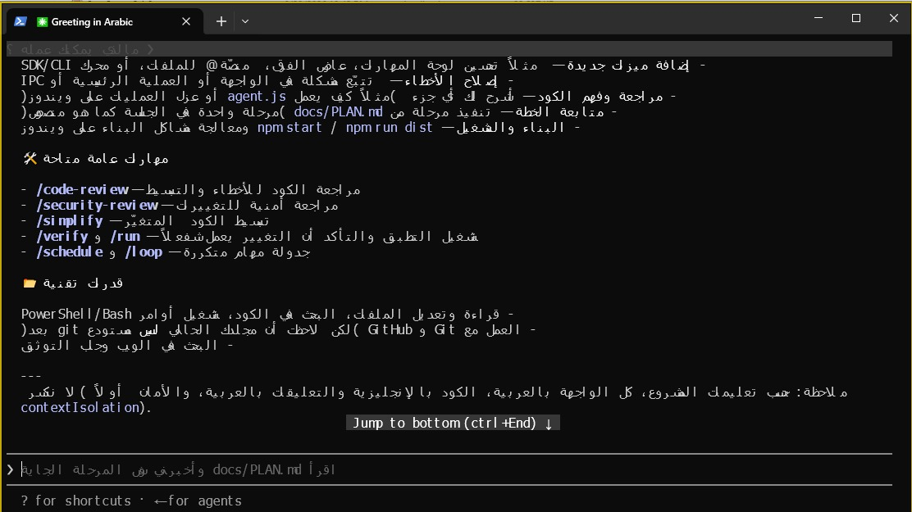
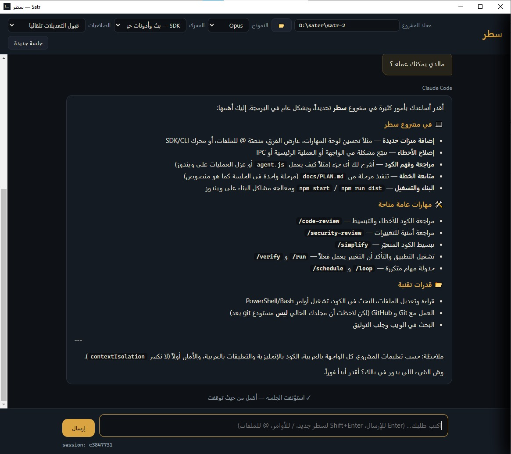
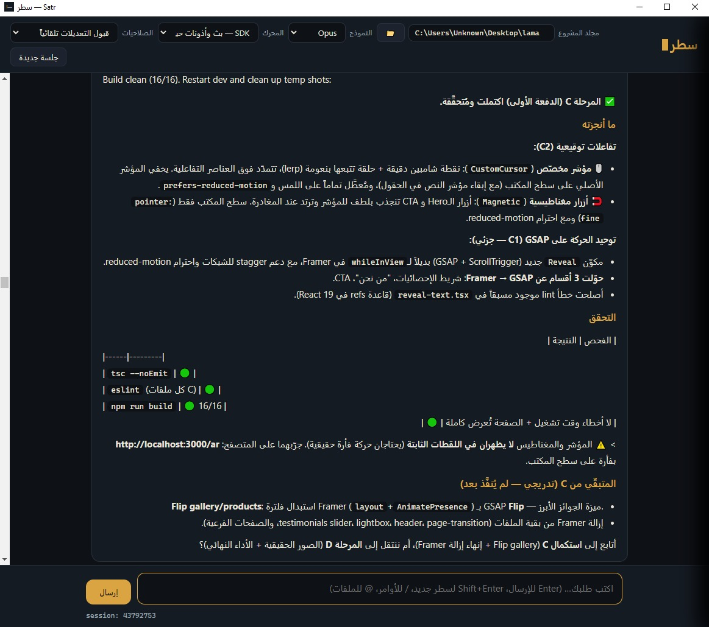

<div dir="rtl">

# سطر ▌ Satr

**البيت العربي لأدوات الذكاء الاصطناعي في سطر الأوامر — يعرض العربية بشكل مثالي حيث تعجز الطرفية.**

<p align="center">
  <a href="LICENSE"></a>
  
  
</p>

---

## ما هو «سطر»؟

«سطر» تطبيق سطح مكتب (Electron) يشغّل **Claude Code** في الخلفية ويعرض محادثتك في واجهة
رسومية عربية تدعم الاتجاه من اليمين لليسار (RTL) وتشكيل الحروف بشكل سليم تماماً.

الرؤية: البيت العربي لكل أدوات CLI الذكية — Claude Code أولاً، ثم أدوات أخرى عبر محوّلات.

## المشكلة التي يحلّها

الطرفيات التقليدية (PowerShell، CMD، وحتى أغلب طرفيات Windows) **لا تدعم خوارزمية
ثنائية الاتجاه (BiDi)** بشكل صحيح. فعند استخدام أدوات الذكاء الاصطناعي التي تكتب بالعربية،
يظهر النص:

- **معكوساً** (الكلمات بترتيب خاطئ).
- **مقطّعاً** (الحروف منفصلة بلا تشكيل/وصل).
- **مختلطاً** بشكل فوضوي عند مزج العربية بالإنجليزية والرموز.

«سطر» يحلّ هذا جذرياً: يعرض المحادثة في **واجهة HTML حقيقية** تطبّق قواعد العربية كاملةً،
فتقرأ ردّ النموذج كما لو كان في محرّر نصوص عربي محترف.

## قبل / بعد

| الطرفية التقليدية (قبل) | «سطر» (بعد) |
| :---: | :---: |
|  |  |

لقطة كاملة للتطبيق:



## المزايا

- **محادثة عربية RTL** بعرض مثالي للحروف والتشكيل والنصوص المختلطة.
- **بثّ حيّ** لردّ النموذج حرفاً بحرف (token streaming).
- **مربّعات أذونات عربية** لكل أداة قبل تنفيذها (موافقة / رفض / موافقة دائمة).
- **عارض فروقات (Diff) عربي** ملوّن مع زرّ **تراجع** يعيد الملف لما قبل التعديل.
- **منصّة `@` للملفات** — بحث تدريجي في ملفات المشروع وإدراج مساراتها.
- **لصق الصور** من الحافظة (Ctrl+V) وإرسالها للنموذج.
- **أوامر مائلة** بالعربية:
  - `/جلسات` — متصفّح جلساتك المحفوظة واستئنافها.
  - `/سياق` — امتلاء نافذة السياق (نسبة + توزيع الرموز).
  - `/ضغط` — تلخيص/ضغط المحادثة الطويلة ومتابعتها.
  - `/موصلات` — حالة خوادم MCP (متّصل / يحتاج مصادقة / معطّل) مع إعادة الاتصال.
  - `/مهارات` — تفعيل/تعطيل المهارات المكتشَفة (Skills).
  - `/فيبل` وأخواتها لاختيار النموذج بسرعة.
- **دعم MCP والمهارات** — يحمّل خوادم MCP وموصّلات claude.ai والمهارات وأذونات الملفات
  تماماً كـ Claude Code التفاعلي.
- **متصفّح الجلسات** — يقرأ جلساتك المحلية ويعرضها ويستأنفها.
- **التحكّم بعمليات الخلفية** — يتتبّع خوادم التطوير التي تُشغّلها الأدوات ويتيح إيقافها بزرّ.

## المتطلّبات

> [!IMPORTANT]
> «سطر» **واجهة** لـ Claude Code، وليس بديلاً عنه. يجب أن يتوفّر التاليان على جهازك:
>
> 1. **Node.js الإصدار 18 أو أحدث** — [nodejs.org](https://nodejs.org/).
> 2. **Claude Code مثبّتاً عالمياً ومُسجَّل الدخول**:
>    ```bash
>    npm install -g @anthropic-ai/claude-code
>    claude   # شغّله مرة واحدة لتسجيل الدخول
>    ```
>
> لا تقلق إن لم يكن مثبّتاً: **معالج أول التشغيل** داخل «سطر» يكتشف غيابه ويرشدك
> خطوة بخطوة بالعربية لتثبيته، ثم يفتح المحادثة بعد الضغط على «أعد الفحص».

## التثبيت (للمستخدمين)

1. نزّل أحدث مثبّت `Satr Setup x.y.z.exe` من صفحة [الإصدارات (Releases)](https://github.com/m4u05999/Satr/releases).
2. شغّل المثبّت (واجهة التثبيت بالعربية بالكامل).
3. افتح «سطر». إن لم يكن Claude Code مثبّتاً، يرشدك معالج أول التشغيل لتثبيته وتسجيل الدخول.

### تنبيه: تحذير Windows SmartScreen

التطبيق **غير موقّع رقمياً** (مشروع مجتمعي مجاني — التوقيع مكلف). لذا قد يظهر لك
حاجز **«حمى Windows جهازك» (SmartScreen)** عند أول تشغيل. هذا متوقّع وآمن:

1. اضغط **«مزيد من المعلومات» (More info)**.
2. ثم اضغط **«تشغيل على أي حال» (Run anyway)**.

يمكنك دائماً مراجعة الكود المصدري هنا بنفسك للتأكّد — فالمشروع مفتوح المصدر بالكامل.

### نصيحة أمان مهمة (git)

قبل استخدام وضع **«قبول التعديلات تلقائياً»**، احفظ مشروعك تحت **git** (`git init` ثم
التزام نظيف). هكذا يمكنك مراجعة أي تعديل أو التراجع عنه بسهولة إن لم يعجبك — وعارض
الفروقات وزرّ التراجع في «سطر» يكمّلان هذه الحماية، لكن git هو شبكة الأمان الأساسية.

## البناء من المصدر (للمساهمين)

```bash
git clone https://github.com/m4u05999/Satr.git
cd Satr
npm install
npm start          # تشغيل للتطوير
npm run dist       # بناء مثبّت ويندوز NSIS في مجلد dist/
```

> [!NOTE]
> **بناء على ويندوز:** يحتاج `npm run dist` إلى استخراج ذاكرة `winCodeSign` التي تحوي
> روابط رمزية (symlinks). فعّل **«وضع المطوّر» (Developer Mode)** في إعدادات ويندوز
> (Settings ← Privacy & security ← For developers) قبل أول بناء، وإلا فشل الاستخراج.
> لمزيد من تفاصيل المعمارية وقواعد المشروع راجع [`CONTRIBUTING.md`](CONTRIBUTING.md) و
> [`CLAUDE.md`](CLAUDE.md).

## بيان الاستقلالية

«سطر» **أداة مجتمعية مستقلة** طوّرها متطوّعون. **هو ليس منتَجاً من Anthropic ولا مدعوماً
منها رسمياً ولا تابعاً لها.** «Claude» و«Claude Code» علامتان تجاريتان لشركة Anthropic،
ويُذكران هنا للإشارة إلى التوافق الوظيفي فقط.

## بيان الخصوصية

- **لا تتبّع (No telemetry).** «سطر» لا يجمع أي بيانات استخدام ولا يرسل أي شيء لأي خادم
  خاصّ به.
- محادثاتك تمرّ **حصراً** عبر نسخة Claude Code المثبّتة على جهازك أنت، بحساب Anthropic
  الخاصّ بك — تماماً كما لو شغّلت `claude` في الطرفية مباشرةً.
- قراءة الجلسات والملفات والمهارات كلها **محلية وقراءة فقط** على جهازك.

## الرعاية

«سطر» مجاني ومفتوح المصدر. إن أردت دعم استمراره (دون أي إلحاح):

☕ [ادعمني على Ko-fi](https://ko-fi.com/m4u05999)

## الرخصة

[رخصة MIT](LICENSE) — © 2026 محمد عبدالرحيم.

</div>
