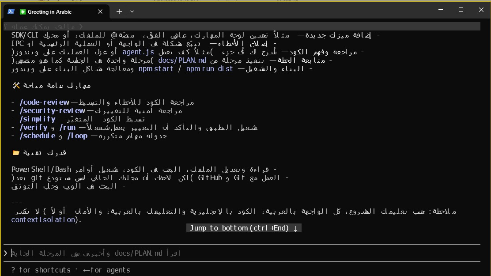
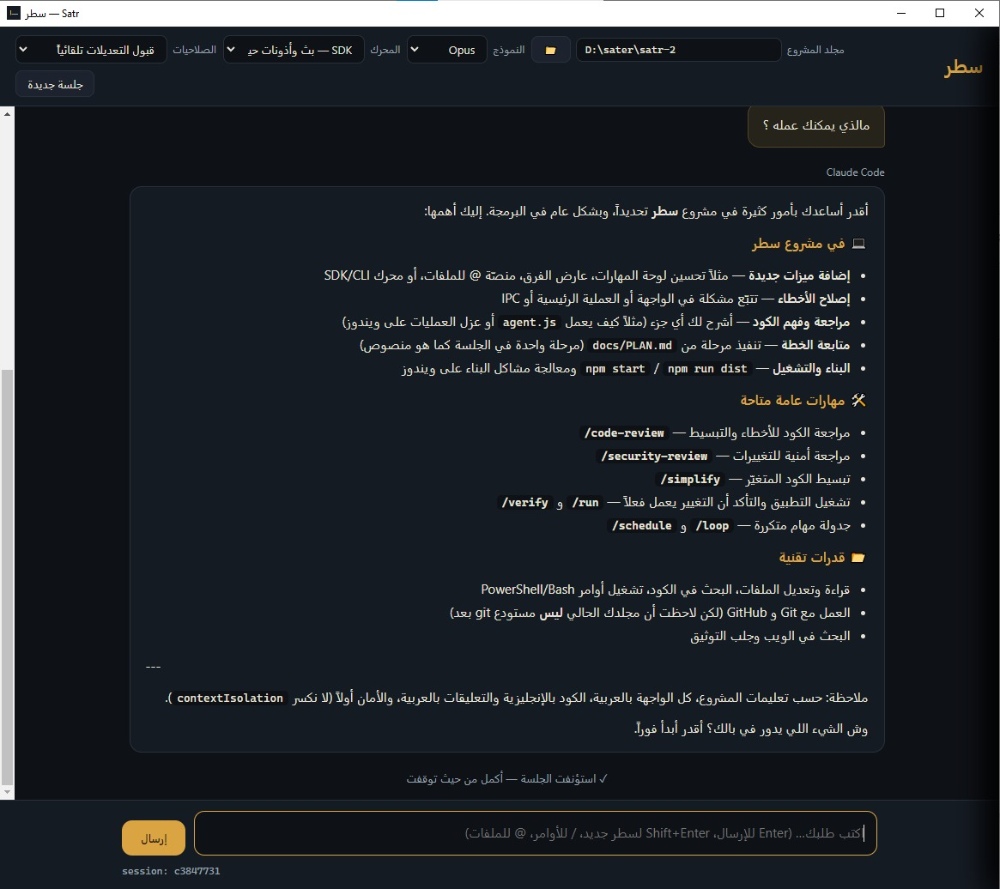
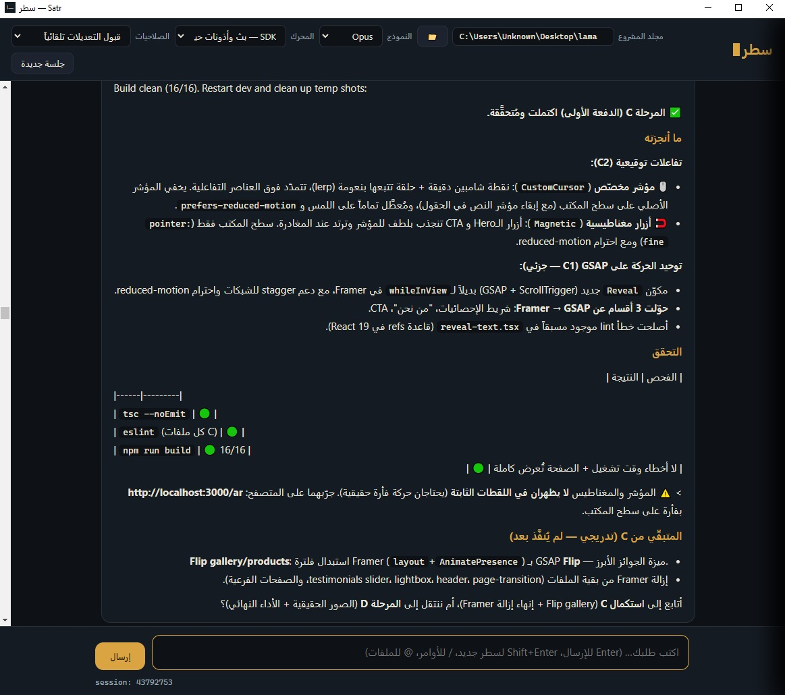

<div dir="rtl">

# سطر ▌ Satr

**البيت العربي لأدوات الذكاء الاصطناعي في سطر الأوامر — يعرض العربية بشكل مثالي حيث تعجز الطرفية.**

<p align="center">
  <a href="LICENSE"></a>
  
  
</p>

---

## ما هو «سطر»؟

«سطر» تطبيق سطح مكتب (Electron) يشغّل **Claude Code** في الخلفية ويعرض محادثتك في واجهة
رسومية عربية تدعم الاتجاه من اليمين لليسار (RTL) وتشكيل الحروف بشكل سليم تماماً.

الرؤية: البيت العربي لكل أدوات CLI الذكية — Claude Code أولاً، ثم أدوات أخرى عبر محوّلات.

## المشكلة التي يحلّها

الطرفيات التقليدية (PowerShell، CMD، وحتى أغلب طرفيات Windows) **لا تدعم خوارزمية
ثنائية الاتجاه (BiDi)** بشكل صحيح. فعند استخدام أدوات الذكاء الاصطناعي التي تكتب بالعربية،
يظهر النص:

- **معكوساً** (الكلمات بترتيب خاطئ).
- **مقطّعاً** (الحروف منفصلة بلا تشكيل/وصل).
- **مختلطاً** بشكل فوضوي عند مزج العربية بالإنجليزية والرموز.

«سطر» يحلّ هذا جذرياً: يعرض المحادثة في **واجهة HTML حقيقية** تطبّق قواعد العربية كاملةً،
فتقرأ ردّ النموذج كما لو كان في محرّر نصوص عربي محترف.

## قبل / بعد

| الطرفية التقليدية (قبل) | «سطر» (بعد) |
| :---: | :---: |
|  |  |

لقطة كاملة للتطبيق:



## الجديد في 2.3: الطرفية العربية المدمجة 🖥️

**أول طرفية على ويندوز تعرض العربية مشكّلةً وصحيحة الاتجاه.** كل الطرفيات — بما فيها
Windows Terminal وVS Code — تعرض العربية حروفاً مقطّعة بترتيب معكوس، لأن محركاتها لا
تدعم خوارزمية BiDi. طرفية «سطر» تحلّ هذا بمعمارية فريدة: محرك طرفية حقيقي (xterm.js +
ConPTY) وفوقه **عارضان يتبادلان بذكاء**:

| | في أي طرفية أخرى | في طرفية «سطر» |
| --- | :---: | :---: |
| `echo "مرحبا بالعالم"` | <div dir="ltr">ة ي ب ر ع ل ا ف و ر ح ل ا ...معكوسة ومقطّعة</div> | مرحبا بالعالم — مشكّلة وصحيحة ✓ |

*(لقطات شاشة حقيقية للطرفية ستُضاف قريباً)*

- زرّ 🖥️ في الشريط العلوي يفتح اللوحة في مجلد مشروعك، بارتفاع قابل للسحب.
- **العرض العربي** (الافتراضي): خرج الأوامر عربياً مشكّلاً صحيح الاتجاه — `git status`
  بأسماء ملفات عربية، سكربتات تطبع عربياً، رسائل أخطاء مختلطة… كلها مقروءة أخيراً.
- **سطر إدخال عربي حقيقي**: اكتب أوامرك بالعربية والإنجليزية بمؤشر سليم؛ Enter ينفّذ،
  ‏Ctrl+C يقطع، ▲▼ تاريخ الصدفة، ولصق متعدد الأسطر يعمل.
- **تبديل تلقائي ذكي**: تطبيقات الشاشة الكاملة (vim/htop) تفتح العرض الشبكي وتعود وحدها؛
  والتطبيقات التي ترتّب العربية بنفسها (مثل `claude` التفاعلي) تُكشف عند إطلاقها.

## المزايا

- **محادثة عربية RTL** بعرض مثالي للحروف والتشكيل والنصوص المختلطة.
- **طرفية عربية مدمجة** — الأولى من نوعها على ويندوز (انظر أعلاه).
- **بثّ حيّ** لردّ النموذج حرفاً بحرف (token streaming).
- **مربّعات أذونات عربية** لكل أداة قبل تنفيذها (موافقة / رفض / موافقة دائمة).
- **عارض فروقات (Diff) عربي** ملوّن مع زرّ **تراجع** يعيد الملف لما قبل التعديل.
- **منصّة `@` للملفات** — بحث تدريجي في ملفات المشروع وإدراج مساراتها.
- **لصق الصور** من الحافظة (Ctrl+V) وإرسالها للنموذج.
- **أوامر مائلة** بالعربية:
  - `/جلسات` — متصفّح جلساتك المحفوظة واستئنافها.
  - `/سياق` — امتلاء نافذة السياق (نسبة + توزيع الرموز).
  - `/ضغط` — تلخيص/ضغط المحادثة الطويلة ومتابعتها.
  - `/موصلات` — حالة خوادم MCP (متّصل / يحتاج مصادقة / معطّل) مع إعادة الاتصال.
  - `/مهارات` — تفعيل/تعطيل المهارات المكتشَفة (Skills).
  - `/فيبل` وأخواتها لاختيار النموذج بسرعة.
- **دعم MCP والمهارات** — يحمّل خوادم MCP وموصّلات claude.ai والمهارات وأذونات الملفات
  تماماً كـ Claude Code التفاعلي.
- **متصفّح الجلسات** — يقرأ جلساتك المحلية ويعرضها ويستأنفها.
- **التحكّم بعمليات الخلفية** — يتتبّع خوادم التطوير التي تُشغّلها الأدوات ويتيح إيقافها بزرّ.

## المتطلّبات

> [!IMPORTANT]
> «سطر» **واجهة** لـ Claude Code، وليس بديلاً عنه. يجب أن يتوفّر التاليان على جهازك:
>
> 1. **Node.js الإصدار 18 أو أحدث** — [nodejs.org](https://nodejs.org/).
> 2. **Claude Code مثبّتاً عالمياً ومُسجَّل الدخول**:
>    ```bash
>    npm install -g @anthropic-ai/claude-code
>    claude   # شغّله مرة واحدة لتسجيل الدخول
>    ```
>
> لا تقلق إن لم يكن مثبّتاً: **معالج أول التشغيل** داخل «سطر» يكتشف غيابه ويرشدك
> خطوة بخطوة بالعربية لتثبيته، ثم يفتح المحادثة بعد الضغط على «أعد الفحص».

## التثبيت (للمستخدمين)

في [صفحة الإصدارات (Releases)](https://github.com/m4u05999/Satr/releases/latest)، انزل إلى
قسم **«Assets»** ونزّل **`Satr-Setup-2.14.0.exe`** — ثم شغّله (واجهة التثبيت عربية بالكامل).
إن لم يكن Claude Code مثبّتاً، يرشدك معالج أول التشغيل لتثبيته وتسجيل الدخول.

> [!WARNING]
> **لا تنزّل «Source code (zip/tar.gz)»** — هذا أرشيف اسمه `Satr-2.14.0.zip` (بشرطة)
> يحوي **شفرة المصدر** (مجلدات `electron` و`src` وملف `package.json`…) **وليس فيه
> التطبيق**. ملف التطبيق فيه كلمة **Setup**: `Satr-Setup-2.14.0.exe` تحت **Assets**.

### ⚠ المتصفح يمنع التنزيل؟ («isn't commonly downloaded» / غير آمن)

التطبيق **غير موقّع رقمياً** (شهادة التوقيع مكلفة سنوياً — مشروع مجتمعي مجاني)، وكل
إصدار جديد يبدأ بسمعة صفر لدى Google Safe Browsing، فقد **يمنع المتصفح تنزيل ملف `.exe`**
قبل اكتماله. هذا حاجز سمعة تلقائي لا علاقة له بأمان الملف. ثلاثة حلول بترتيب السهولة:

1. **نزّل `Satr-Setup-2.14.0.zip`** (تحت Assets، بكلمة Setup — لا «Source code») بدل الـ
   `.exe` — تمرّ من الحاجز غالباً؛ فُكّ الضغط فتجد **المثبّت `.exe` مباشرة** بداخله، وشغّله.
2. **في تحذير التنزيل**: اضغط السهم `⌄` بجانب التحذير ← **«الاحتفاظ» (Keep)** ← ثم
   «الاحتفاظ رغم ذلك» (Keep anyway). (في بعض المتصفحات يلزم فتح «التنزيلات» ثم Keep.)
3. **تنزيل مباشر يتجاوز المتصفح كلياً** — الصق في PowerShell:
   ```powershell
   irm "https://github.com/m4u05999/Satr/releases/latest/download/Satr-Setup-2.14.0.exe" -OutFile "$HOME\Downloads\Satr.Setup.exe"
   ```

**تحقّق من سلامة الملف (اختياري)** — احسب بصمة SHA-256 للملف وقارنها بالبصمة المنشورة في
**ملاحظات الإصدار** على [صفحة الإصدارات](https://github.com/m4u05999/Satr/releases/latest)
(تُدرَج آلياً مع كل نسخة عبر خط النشر):
```powershell
(Get-FileHash "$HOME\Downloads\Satr-Setup-2.14.0.exe" -Algorithm SHA256).Hash
```

### تنبيه: تحذير Windows SmartScreen (عند التشغيل)

بعد التنزيل، قد يظهر عند **أول تشغيل** حاجز **«حمى Windows جهازك» (SmartScreen)** — لنفس
سبب غياب التوقيع. آمن ومتوقّع:

1. اضغط **«مزيد من المعلومات» (More info)**.
2. ثم اضغط **«تشغيل على أي حال» (Run anyway)**.

يمكنك دائماً مراجعة الكود المصدري هنا بنفسك للتأكّد — فالشفرة عامة بالكامل
(source-available). والتحديث التلقائي مدمج منذ 2.4.1؛ التوقيع الرقمي على خارطة الطريق.

### نصيحة أمان مهمة (git)

قبل استخدام وضع **«قبول التعديلات تلقائياً»**، احفظ مشروعك تحت **git** (`git init` ثم
التزام نظيف). هكذا يمكنك مراجعة أي تعديل أو التراجع عنه بسهولة إن لم يعجبك — وعارض
الفروقات وزرّ التراجع في «سطر» يكمّلان هذه الحماية، لكن git هو شبكة الأمان الأساسية.

## البناء من المصدر (للمساهمين)

```bash
git clone https://github.com/m4u05999/Satr.git
cd Satr
npm install
npm start          # تشغيل للتطوير
npm run dist       # بناء مثبّت ويندوز NSIS في مجلد dist/
```

> [!NOTE]
> **بناء على ويندوز:** يحتاج `npm run dist` إلى استخراج ذاكرة `winCodeSign` التي تحوي
> روابط رمزية (symlinks). فعّل **«وضع المطوّر» (Developer Mode)** في إعدادات ويندوز
> (Settings ← Privacy & security ← For developers) قبل أول بناء، وإلا فشل الاستخراج.
> لمزيد من تفاصيل المعمارية وقواعد المشروع راجع [`CONTRIBUTING.md`](CONTRIBUTING.md) و
> [`CLAUDE.md`](CLAUDE.md).

## بيان الاستقلالية

«سطر» **أداة مجتمعية مستقلة** طوّرها متطوّعون. **هو ليس منتَجاً من Anthropic ولا مدعوماً
منها رسمياً ولا تابعاً لها.** «Claude» و«Claude Code» علامتان تجاريتان لشركة Anthropic،
ويُذكران هنا للإشارة إلى التوافق الوظيفي فقط.

## بيان الخصوصية

- **لا تتبّع (No telemetry).** «سطر» لا يجمع أي بيانات استخدام ولا يرسل أي شيء لأي خادم
  خاصّ به.
- محادثاتك تمرّ **حصراً** عبر نسخة Claude Code المثبّتة على جهازك أنت، بحساب Anthropic
  الخاصّ بك — تماماً كما لو شغّلت `claude` في الطرفية مباشرةً.
- قراءة الجلسات والملفات والمهارات كلها **محلية وقراءة فقط** على جهازك.

## الرعاية

«سطر» مجاني ومفتوح المصدر. إن أردت دعم استمراره (دون أي إلحاح):

☕ [ادعمني على Ko-fi](https://ko-fi.com/m4u05999)

## الرخصة

[رخصة FSL-1.1-MIT](LICENSE) (‏Functional Source License) — © 2026 محمد عبدالرحيم.

**بالعربية الواضحة:** الكود متاح للجميع قراءةً وتعديلاً واستخداماً **مجاناً لأي غرض** —
فرداً كنت أو شركة — عدا شيء واحد: لا يجوز أخذ الكود لبناء منتج أو خدمة **تنافس «سطر»**
أو إعادة بيعه. وكل إصدار يتحول **تلقائياً إلى رخصة MIT الكاملة بعد سنتين** من نشره.

**In plain English:** the source is public and free to use, modify and
self-host for any purpose — except building a competing product or reselling
it. Each release automatically becomes MIT-licensed two years after it ships
(see the Grant of Future License in [LICENSE](LICENSE)).

الإصدارات المنشورة حتى v2.10.0 صدرت تحت رخصة MIT وتبقى كذلك؛ الانتقال إلى FSL يسري
من v2.14.0 فصاعداً.

</div>
